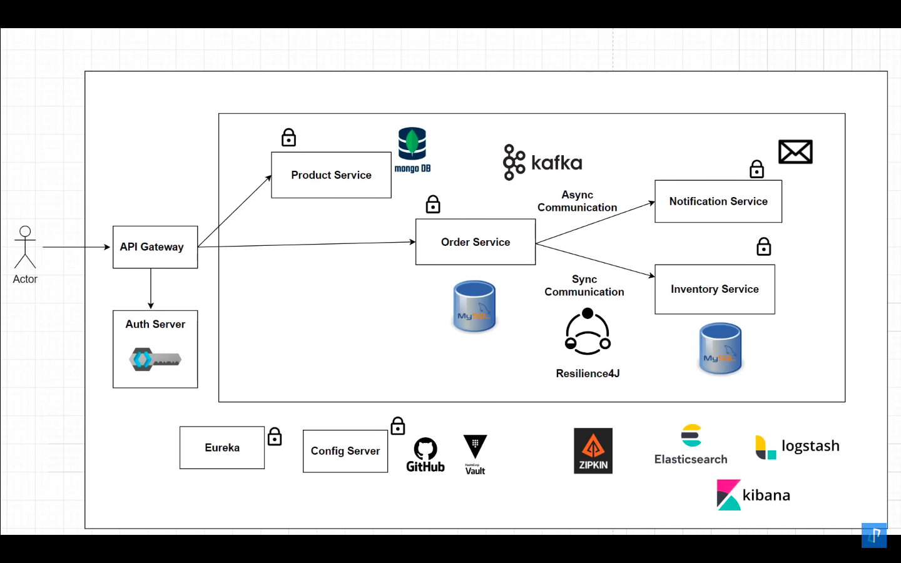
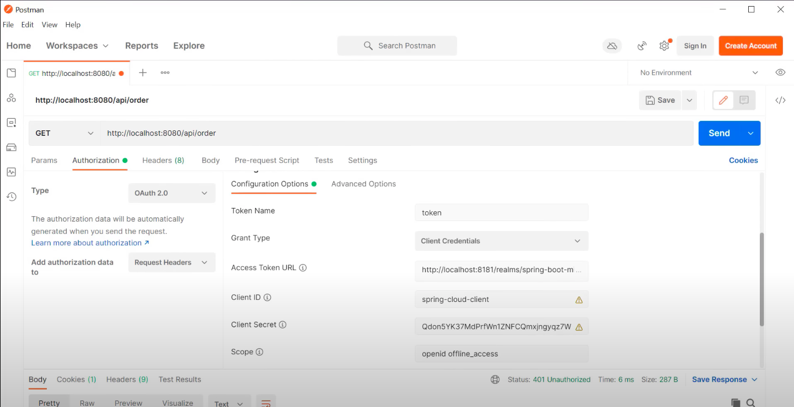
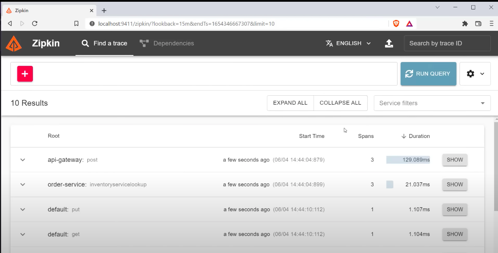
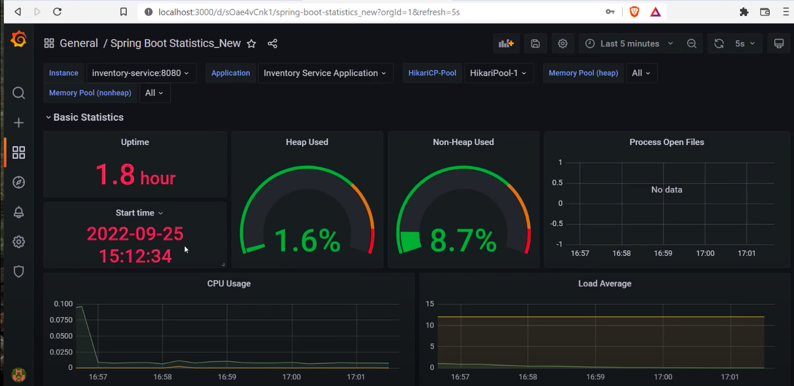

# 🛍️ ECommerece Microservices Sample

> `ECommerece Microservices` is a fictional ecommerce sample, built with Spring and different software architecture and technologies like **Microservices Architecture**, **Domain Driven Design (DDD)**, **Event Driven Architecture**. For communication between independent services, we use asynchronous messaging with using kafka on top of library, and sometimes we use synchronous communication for real-time communications with using REST and gRPC calls.

# Table of Contents

- [Technologies - Libraries](#technologies---libraries)
  - [Framework](#framework)
  - [Database](#database)
  - [Tracking and Monitoring](#tracking-and-monitoring)
  - [Services](#services)
- [Plan](#plan)
- [Application Architecture](#application-architecture)
- [Prerequisites](#prerequisites)
- [Setup](#setup)
- [Demo](#demo)
- [Resource](#resource)
- [Project References](#project-references)

                                                                                                                                          

## Technologies - Libraries
- #### Framework
    - Spring boot (3.1.4)
    - Spring cloud

- #### Database
    - ✅ Using `Postgres`,`Mongo` for read,write database 
- #### Tracking and Monitoring
    - ✅ Using `Prometheus`,`Grafana` with serilog and exporting logs to 
- #### Services
    - ✅ Using Keycloak: authentication and authorization
    - ✅ Using `Prometheus`,`Grafana` with serilog and exporting logs to 
    - ✅ Using Docker and `docker-compose` for deployment

## Plan

> This project is in progress, New features will be added over time.

| Feature          | Architecture Pattern                                                                         
| ---------------- | ------------------------------------- 
| API Gateway      | Microsoft YARP Reverse Proxy  
| Discovery Service | Manage the registered service       
| Product Service | Data Centeric Architecture (CRUD)                              
| Order Service    | Event Sourccing, Domain Driven                                                            | Inventory Service    | Event Sourccing, Domain Driven                                                  
| Notification Service | Event Sourccing   
                                          

## Application Architecture

## Setup
### How to run the application using Docker

1. Run `mvn clean package -DskipTests` to build the applications and create the docker image locally.
2. Run `docker-compose up -d` to start the applications.

### How to run the application without Docker

1. Run `mvn clean verify -DskipTests` by going inside each folder to build the applications.
2. After that run `mvn spring-boot:run` by going inside each folder to start the applications.

## Demo:
- ### Keycloak:
    
    
- ### Zipkin:
    
- ### Grafana:
    

## Resource
- Api document: 
    - https://documenter.getpostman.com/view/17649648/2s9YJZ34mY

## Project References

- [https://www.youtube.com/playlist?list=PLDHSigHSDJWUTBa8r8tvQDQMZbemLBNp4](https://www.youtube.com/playlist?list=PLDHSigHSDJWUTBa8r8tvQDQMZbemLBNp4)

